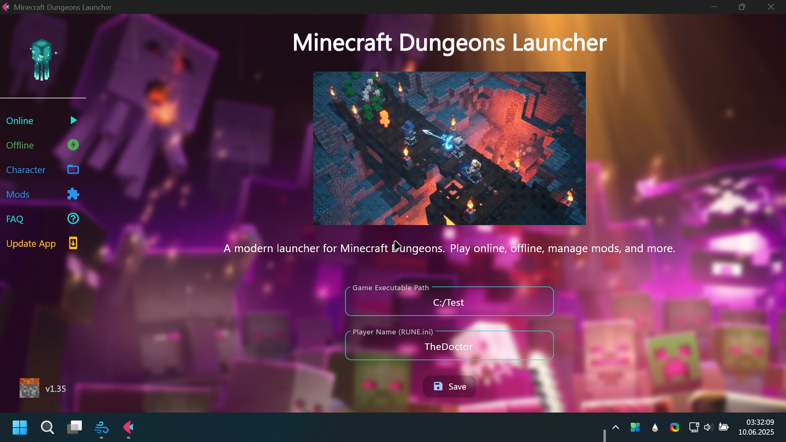

<p align="center">
  <picture>
	<source media="(prefers-color-scheme: dark)" srcset="assets/Minecraft_Dungeons_Ultimate_Edition.png" width="400px">
	
  </picture>
</p>

<p align="center">
  <strong>🧱 A Feature-Rich Minecraft Dungeons Launcher with Offline Play Support 🎮</strong>
  <br><br>
  <a href="https://thedoctor.ct.ws"><strong>🌐 TheDoctor's Socials</strong></a>
</p>

---

# 🚀 Installation

You can either **build from source** or use the **precompiled Windows installer** available on the [Releases Page](https://github.com/yourrepo/releases).

## 🔧 Building from Source

### ✅ Windows
```bash
pip install -r requirements.txt
python main.py
```

> 💡 Tip: Open a terminal in the project directory before running the command.

~~### 🐧 Linux~~  
> ⚠️ Currently not supported on Linux.

---

## 📴 Offline Mode Reminder  
🔌 Please **enable Flight Mode** and **disable Wi-Fi** when playing offline!

---

# ❓ FAQ

### ❓ Which Minecraft Dungeons versions are supported?
- ✅ Only the **Minecraft Launcher Version** is supported.  
- ✅ The **Microsoft Store / Xbox Version** *is not recommended, but works with latest development build.

### ⚙️ Packaging Command
```bash
flet pack main.py --name MCDLauncher --file-description MCDLauncher --product-name MCD_Launcher --icon ./assets/favicon.ico
```

### 📦 Where to find mods?
- 🔗 [**CurseForge**](https://www.curseforge.com/minecraft-dungeons)  
- 🔗 [**NexusMods**](https://www.nexusmods.com/minecraftdungeons)

### 🧩 Source code for the DLL?
- 🧵 [**CSRinRu Forum Thread**](https://cs.rin.ru/forum/viewtopic.php?f=10&t=97669&hilit=minecraft+dungeons)

### 🛠️ Modding Tools
- 🧰 [**Mod Kit**](https://www.curseforge.com/minecraft-dungeons/utility/dungeons-mod-kit)  
- 💾 [**MCD Save Editor**](https://github.com/CutFlame/MCDSaveEdit)

> 📝 Note: For Microsoft Store/Xbox users, you *might* get it working by editing `RUNE.ini` with your player name and copying it along with `winm.dll` into the game directory where `Dungeons-Win64-Shipping.exe` is located.

---

# 🖼️ Preview

<p align="center">
  
</p>

---

<p align="center">
  
</p>

<p align="center">
  🛠️ A project by <strong>TheDoctor</strong>
</p>

<p align="center">
  ❤️ Built with love to improve the amazing Minecraft Dungeons experience and keep it alive with offline support — perfect for gaming on the go!<br><br>
  ⚠️ <strong>Unofficial Launcher — Not affiliated with Mojang!</strong><br>
  🎫 You need a <strong>legit copy</strong> of the game to use this launcher.<br><br>
  🙏 <strong>Support future development & my work:</strong><br>
  <strong>Wallet Address:</strong> <code>0x4338665CBB7B2485A8855A139b75D5e34AB0DB94</code><br>
  <strong>ETH Wallet:</strong> <code>0xfbe3E2337e7bCfC9245f0C2eAeF16597f0Bb2Dc2</code>
</p>


